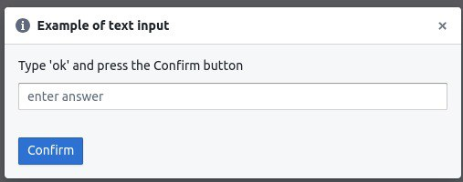
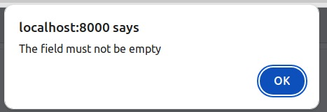

# HardPy panel

The **hardpy panel** or operator panel is a web interface that displays and controls the testing process in **HardPy**.

## Capability

**HardPy panel** allows you to:

- Start and stop testing;
- Interact with [dialog box](hardpy_panel.md#dialog-box) during testing;
- Browse:
    - Test run name.
    - Test run status.
    - Test module name.
    - Duration of test modules execution.
    - Test module status.
    - Test case name.
    - Test case message.
    - Test case status.
- Browse current [statestore](database.md#statestore-scheme) state in debug mode.

## Usage

You can launch **hardpy panel** by using the command `hardpy-panel [...]`, where `[...]` is a tests directory.
After this open page http://localhost:8000/ in the browser.

When the operator panel is running, you can run tests through the web interface or through
the pytest launcher (in a terminal or from another application).

### Dialog box

For user interaction with the test, it is possible to use dialog boxes.
An example of usage can be seen in the example [dialog box](../examples/dialog_box.md).
Currently, there are some types of dialog boxes.

#### basic dialog box

Contains an instruction or question and a `confirm` button for confirmation.


#### text input field

Contains an instruction or question, a text input field, and a `confirm` button for confirmation.
The text is transmitted in UTF-8 encoding.



#### number input field

Contains an instruction or question, a number input field, and a `confirm` button for confirmation.

* Allows float numbers with a dot separator.
* Allows negative numbers.
* Allows numbers to be entered using **E notation** with `e`, e.g. `2e3`.
* The entered numbers will be converted to float.


#### warning window

If the user clicks `confirm` without entering anything, a warning window will be displayed.



#### error notification

If the user closes the dialog box (using the cross in the upper right corner),
the tests will be stopped, an error message will be displayed.


### Options

The operator panel has some options.
To view all options run `hardpy-panel -h`.

#### db_user

**Statestore** and **runstore** databases

The CouchDB instance user name for the **statestore** and **runstore** databases.
The default is *dev*.

```bash
-dbu DB_USER, --db_user DB_USER
```

#### db_pswd

The CouchDB instance password for the **statestore** and **runstore** databases.
The default is *dev*.

```bash
-dbpw DB_PSWD, --db_pswd DB_PSWD
```

#### db_port

The CouchDB instance port number for the **statestore** and **runstore** databases.
The default is *5984*.

```bash
-dbp DB_PORT, --db_port DB_PORT
```

#### db_host

The CouchDB instance hostname for the **statestore** and **runstore** databases.
The default is *localhost*.

```bash
-dbh DB_HOST, --db_host DB_HOST
```

#### web_host

The web interface hostname.
The default is *localhost*.

```bash
-wh WEB_HOST, --web_host WEB_HOST
```

#### web_port

The web interface port number.
The default is *8000*.

```bash
-wp WEB_PORT, --web_port WEB_PORT
```

#### sck_port

Internal socket port for passing backend data (such as a dialog box) to running pytest tests.
The default is *6525*.

```bash
-sp SCK_PORT, --sck_port SCK_PORT
```

#### sck_addr

Internal socket address for passing backend data (such as a dialog box) to running pytest tests.
The default is *localhost*.

```bash
-sa SCK_ADDR, --sck_addr SCK_ADDR
```
