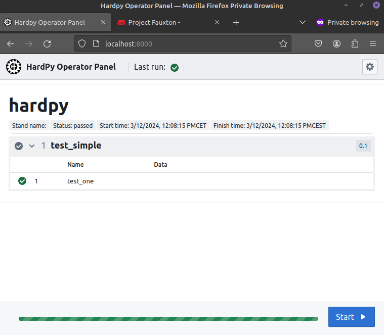

# Overview

<figure markdown="span">
  { width="192" }
</figure>

**HardPy** is a python package for creating a test bench for devices.
**HardPy** allows you to:

* Create test benches for devices using pytest;
* Use a browser to view, run and stop tests;
* Store the test result to the [CouchDB](https://couchdb.apache.org/) database.

## To Install

```bash
pip3 install hardpy
```

## Getting Started

#### CouchDB

Launch CouchDB with Docker.
Create `couchdb.ini` file:

```ini
[chttpd]
enable_cors=true

[cors]
origins = *
methods = GET, PUT, POST, HEAD, DELETE
credentials = true
headers = accept, authorization, content-type, origin, referer, x-csrf-token
```

Run the Docker container from folder with couchdb.ini file:

```bash
docker run --name couchdb -p 5984:5984 -e COUCHDB_USER=dev -e COUCHDB_PASSWORD=dev -v ./couchdb.ini:/opt/couchdb/etc/local.ini couchdb:3.3
```

#### Create tests

Add simple test to `tests` folder

```python
# test_1.py
import pytest

def test_one():
    assert 42 == 42
```
#### Operator panel

Launch `hardpy-panel` from tests folder or launch `hardpy-panel tests` and open page http://localhost:8000/ in browser.

<figure markdown="span">
  { width="800" }
  <figcaption>HardPy operator panel</figcaption>
</figure>

#### Test report

The last test report stores in **runstore** database, document - **current**.
You can view the CouchDB instance through Fauxton web interface: http://127.0.0.1:5984/_utils

<figure markdown="span">
  { width="800" }
  <figcaption>Database view</figcaption>
</figure>
